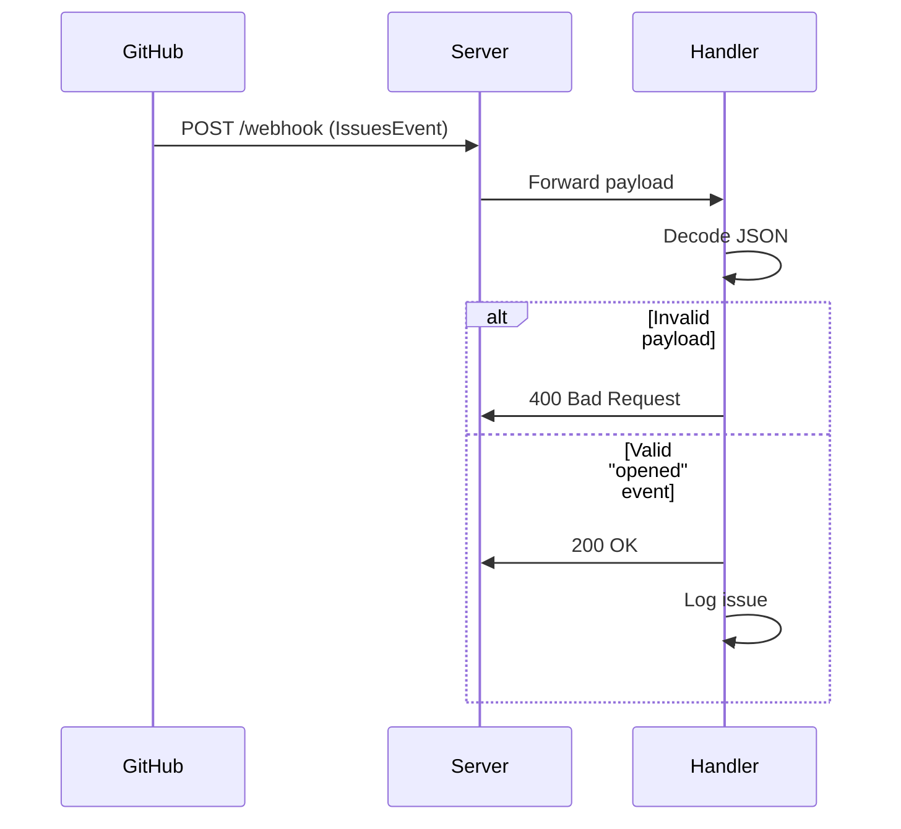

# Step 3: GitHub Webhook Endpoint Implementation

**Branch:** [`step3-webhook-endpoint`](https://github.com/lentregu/gh-autoresponder/tree/step3-webhook-endpoint)  
**Created Files:**
- `internal/webhook/issue_handler.go`
- `internal/server/routes.go`
- `doc/step3-webhook-endpoint.md`

**Modified Files:**
- `cmd/server/main.go`
- `internal/server/server.go`

## � Tutorial Navigation

| Previous | Next |
|----------|------|
| [Step 2: HTTP Server →](step2-basic-server.md) | [Step 4: GitHub Integration →](step4-github-auth.md) |

## 🏗 Implementation Overview

We've extended our server to:
- Handle GitHub webhook payloads
- Route requests using Gorilla Mux
- Process IssuesEvent webhooks
- Add health check endpoint

## 📂 Repository Structure

```text
gh-autoresponder/
├── internal/
│   ├── server/
│   │   ├── server.go    # Updated with router setup
│   │   └── routes.go    # NEW - Route definitions
│   └── webhook/
│       └── issue_handler.go  # NEW - Webhook logic
```

# 🧠 Core Components

## 1. Webhook Handler (`internal/webhook/issue_handler.go`)

```go
type IssueHandler struct{}

func (h *IssueHandler) ServeHTTP(w http.ResponseWriter, r *http.Request) {
    var event github.IssuesEvent
    if err := json.NewDecoder(r.Body).Decode(&event); err != nil {
        log.Printf("Error decoding webhook: %v", err)
        http.Error(w, "Bad request", http.StatusBadRequest)
        return
    }
    
    if event.GetAction() == "opened" {
        log.Printf("Issue #%d opened", event.GetIssue().GetNumber())
    }
    w.WriteHeader(http.StatusOK)
}
```
## 2. Router Setup (internal/server/routes.go)

```go
func setupRouter(issueHandler http.Handler) *mux.Router {
    r := mux.NewRouter()
    r.HandleFunc("/health", healthCheck).Methods("GET")
    r.Handle("/webhook", issueHandler).Methods("POST")
    return r
}
```

## 3. Updated Server Initialization (internal/server/server.go)

```go
func New(port string, issueHandler http.Handler) *Server {
    router := setupRouter(issueHandler)  // Now takes handler
    return &Server{
        httpServer: &http.Server{
            Addr:    ":" + port,
            Handler: router,  // Uses configured router
        },
        shutdown: make(chan os.Signal, 1),
    }
}
```
## 🚀 Startup Sequence (`cmd/server/server.go`)
```go
func main() {
    issueHandler := webhook.NewIssueHandler()  // Create handler
    srv := server.New("8080", issueHandler)   // Inject dependency
    srv.Start()
}
```
## 🛠 Key Features

## Webhook Routing
| Feature          | Implementation                 | Benefit                          |
|------------------|--------------------------------|----------------------------------|
| Path Routing     | `mux.NewRouter()`              | Clean URL separation             |
| Method Filtering | `.Methods("POST")`             | Strict HTTP verb enforcement     |
| Handler Binding  | `r.Handle("/webhook", handler)`| Decoupled endpoint management    |

## Payload Processing
| Scenario        | Status Code    | Logging Action                     |
|-----------------|---------------|------------------------------------|
| Valid JSON      | 200 OK        | Logs issue number if "opened"      |
| Invalid JSON    | 400 Bad Request | Logs decoding error               |
| Unsupported Event | 200 OK       | Silent (future extensibility)      |

## Handler Methods
| Method          | Parameters               | Returns       | Thread Safety |
|-----------------|--------------------------|---------------|---------------|
| `NewIssueHandler()` | None                  | `http.Handler`| ✅ Yes         |
| `ServeHTTP()`   | `(w http.ResponseWriter, r *http.Request)` | None | ❌ No (per-request) |

## Health Check
| Endpoint  | Method | Response Body | Typical Use Case         |
|-----------|--------|---------------|--------------------------|
| `/health` | GET    | "OK"          | Kubernetes liveness probe|

## Dependencies
| Package                      | Version  | Purpose                     |
|------------------------------|----------|-----------------------------|
| `github.com/gorilla/mux`     | v1.8.1   | HTTP routing                |
| `github.com/google/go-github`| v57.0.0  | GitHub event type definitions|

## Signal Handling
| Signal       | Trigger              | Server Response            |
|--------------|----------------------|----------------------------|
| `SIGTERM`    | `kill -15`           | Graceful shutdown          |
| `SIGINT`     | CTRL+C               | Immediate cleanup          |
| `SIGHUP`     | Configuration reload | *(Future use)*             |

## Webhook Processing Flow

  

# 🧪 Testing Guide

## Start Server
```bash
go run cmd/server/main.go
```
## Test Health Check
curl http://localhost:8080/health 

- Expected OK

## Simulate Webhook
curl -X POST http://localhost:8080/webhook \
-H "Content-Type: application/json" \
-d '{"action":"opened","issue":{"number":123}}'

- Note: check server logs for "Issue #123 opened"'

# Next Steps

- Step 4: GitHub App Authentication - Add secret verification

- Step 5: Issue Comments - Implement actual responses